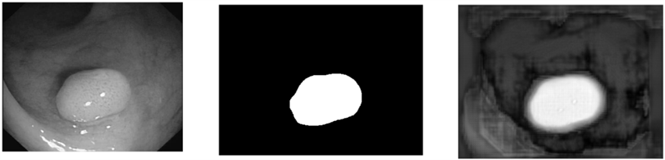

# Medical image UNet 구현
 

# Model
## UNet  
 

# Dataset
## 본 데이터는 Kvasir-SEG, CVC-ColonDB, EndoScene, ETIS-Larib Polyp DB and CVC-Clinic DB 데이터셋을 합쳐놓았으며, 'PraNet'으로부터 가져온 데이터셋을 사용하여 훈련   
 

# Metric
## Dice score : 0.83
 

# result
## row image, target mask, predict
